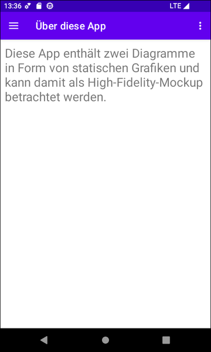
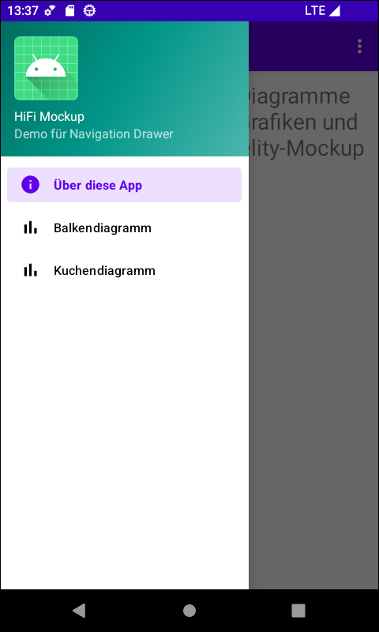
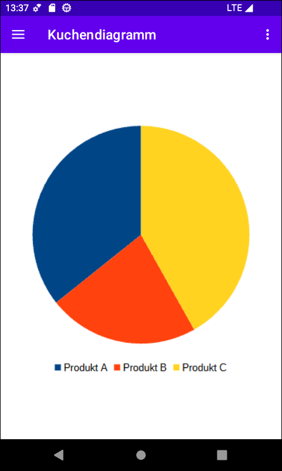

# HiFi Mockup #

 

Diese Repo enthält ein Android-Studio-Projekt für eine native Android-App mit Java.
Die App verwendet einen *Navigation Drawer* für die Navigation zwischen drei verschiedenen
Seiten (realisiert als Fragmente), von denen zwei statische Screenshots von Diagrammen
(ein Balken- und ein Kuchendiagramm) enthalten.
Die Funktion der Darstellung von dynamisch nachgeladenen Daten über Diagramme ist also
nur simuliert, weshalb die App als *High Fidelity Mockup* betrachtet werden kann.

 

----

## Screenshots ##

 

 &nbsp; 

 

## License ##

 

See the [LICENSE file](LICENSE.md) for license rights and limitations (BSD 3-Clause License).

 
